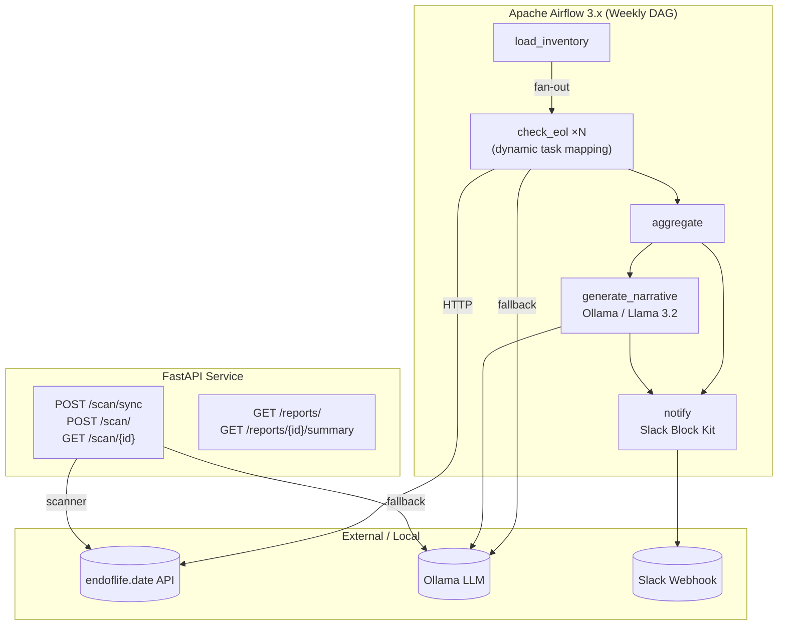

# AIOps Sentinel 🛡️

[](https://github.com/Mathewliji/AI-ML/actions/workflows/ci.yml)


> **Automated end-of-life monitoring for Docker base images** — powered by [endoflife.date](https://endoflife.date) API, local LLM (Ollama), Apache Airflow 3.x, and FastAPI.

AIOps Sentinel runs a weekly Airflow DAG that scans your Docker component inventory, flags everything approaching or past end-of-life, asks a local Llama 3.2 model to generate a plain-English risk narrative, and fires a Slack alert. A FastAPI service exposes the same scanner as a REST API for on-demand scans from CI/CD pipelines.

---

## Architecture



---

## Features

| Feature | Details |
|---|---|
| **EOL data source** | [endoflife.date](https://endoflife.date) public API — 300+ products |
| **LLM fallback** | Ollama (Llama 3.2) for unknown/niche components |
| **Fuzzy slug matching** | `difflib` resolves `"node"` → `"nodejs"` automatically |
| **Airflow DAG** | Dynamic task mapping — one task per inventory item, fan-out pattern |
| **REST API** | Async + sync scan endpoints; poll-for-result pattern |
| **Slack alerts** | Block Kit messages with emoji status, AI narrative, and item breakdown |
| **Pydantic v2** | Typed models with validators throughout |
| **Fully Dockerised** | One `docker compose up` brings up everything |

---

## Quick Start

```bash
# 1. Clone
git clone https://github.com/Mathewliji/AI-ML.git
cd aiops-sentinel

# 2. Configure
cp .env.example .env
# Edit .env — only SLACK_WEBHOOK_URL is optional

# 3. Start (first run pulls the Ollama model — ~2 GB, takes a few minutes)
docker compose up -d

# 4. Pull the LLM model
docker exec -it aiops-sentinel-ollama-1 ollama pull llama3.2

# 5. Open Airflow UI
open http://localhost:8080     # admin / admin

# 6. Open API docs
open http://localhost:8000/docs
```

---

## API Reference

### `POST /scan/sync`
Synchronous EOL scan — blocks until all items are checked.

```json
// Request
{
  "items": [
    {"name": "nginx",  "version": "1.24"},
    {"name": "python", "version": "3.9"},
    {"name": "redis",  "version": "6.2"}
  ],
  "days_warn": 45,
  "notify_slack": false
}

// Response
{
  "scan_id": "scan_20240420_abc123",
  "scanned_at": "2024-04-20T08:00:00Z",
  "total": 3,
  "at_risk": 2,
  "results": [
    {
      "name": "python", "version": "3.9",
      "eol_date": "2025-10-05",
      "status": "critical",
      "days_remaining": 12,
      "source": "api"
    }
  ]
}
```

### `POST /scan/` → `GET /scan/{scan_id}`
Async scan — returns `scan_id` immediately; poll for results.

```bash
SCAN_ID=$(curl -s -X POST http://localhost:8000/scan/ \
  -H "Content-Type: application/json" \
  -d '{"items":[{"name":"debian","version":"10"}]}' | jq -r .scan_id)

curl http://localhost:8000/scan/$SCAN_ID
```

### `GET /reports/`
List all completed scans (most recent first).

### `GET /reports/{scan_id}/summary`
Breakdown by status + at-risk items for a specific scan.

---

## EOL Status Values

| Status | Meaning |
|---|---|
| `ok` | In support, >45 days remaining (configurable) |
| `critical` | In support, <45 days remaining |
| `expired` | Past EOL date |
| `active` | Actively maintained (no fixed EOL) |
| `unknown` | Not found in API or LLM |

---

## Airflow DAG

The `docker_eol_monitor` DAG runs every Monday at 08:00 UTC.

```
load_inventory
     │
     ├─ check_eol(nginx 1.24)   ─┐
     ├─ check_eol(redis 7.0)    ─┤
     ├─ check_eol(python 3.9)   ─┤  dynamic task mapping
     └─ check_eol(debian 10)    ─┘
                                  │
                             aggregate
                            ┌──────┴──────┐
                    generate_narrative   notify (Slack)
```

Override the inventory at runtime via **Trigger DAG w/ config** in the Airflow UI:

```json
{
  "days_warn": 30,
  "inventory": [
    {"name": "ubuntu", "version": "20.04"},
    {"name": "golang", "version": "1.19"}
  ]
}
```

---

## Project Structure

```
aiops-sentinel/
├── scanner/
│   ├── models.py          # Pydantic v2 shared models
│   ├── eol_checker.py     # endoflife.date API + difflib fuzzy match + LLM fallback
│   ├── llm_analyzer.py    # Ollama wrapper (ask_eol + summarize_risks)
│   └── notifier.py        # Slack Block Kit + HTML email
├── api/
│   ├── main.py            # FastAPI app (CORS, lifespan, routers)
│   └── routes/
│       ├── scan.py        # POST /scan/, GET /scan/{id}, POST /scan/sync
│       └── reports.py     # GET /reports/, GET /reports/{id}/summary
├── dags/
│   └── docker_eol_monitor.py   # Airflow 3.x DAG
├── tests/
│   ├── test_eol_checker.py     # Unit tests (httpx mocked)
│   └── test_api.py             # API integration tests (TestClient)
├── Dockerfile
├── docker-compose.yml
└── .env.example
```

---

## Running Tests

```bash
pip install -r requirements.txt
pytest tests/ -v
```

---

## Tech Stack

| Layer | Technology |
|---|---|
| Orchestration | Apache Airflow 3.x (dynamic task mapping, Params, Variables) |
| LLM | Ollama + Llama 3.2 (local, no API key needed) |
| API | FastAPI + Pydantic v2 + uvicorn |
| HTTP client | httpx (async-ready) |
| Data | endoflife.date public REST API |
| Notifications | Slack Block Kit webhooks |
| Containers | Docker + Docker Compose |
| Testing | pytest + unittest.mock + FastAPI TestClient |
| CI | GitHub Actions (matrix: Python 3.11 / 3.12) |

---

## License

MIT — see [LICENSE](LICENSE).
